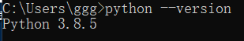
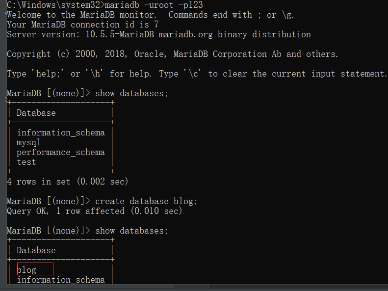
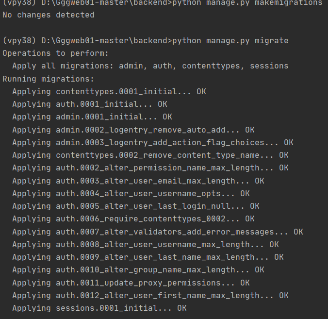
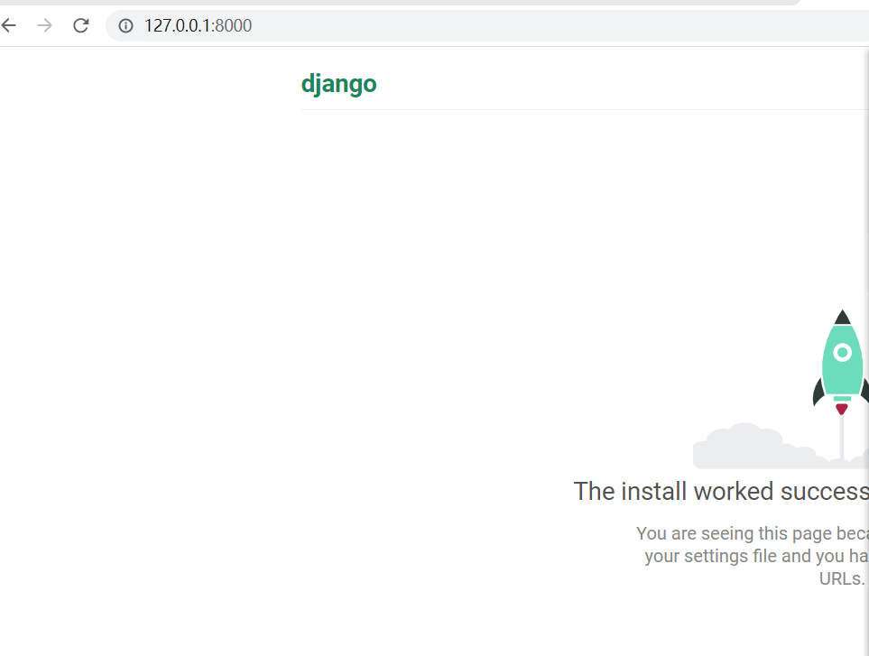

# 01 初始化django项目
## 一， 安装需要的环境
1. 从python官网下载python版本，这里使用的是python3.8
2. 安装后检查是否添加环境变量，如果已经添加，如已经添加则可以在cmd上执行以下命令

# 二， 安装python 虚拟环境
## 1. 生成虚拟环境并初始化项目
```
pip install virtualenv && D: && md venv && cd venv && virtualenv venvpy38
cd venvpy38 && cd Scripts && activate.bat
# 至此就能看到命令行的行首提示符变成了(venvpy38)D:\...
pip install django #给虚拟环境上装上django
D: && md myweb && cd myweb && django-admin startproject backend && cd backend && python manage.py startapp myblog
```
## 2. 初始化数据库
> 注:开发者使用的是mariadb,命令基本与mysql一致，如用mysql，替换命令里的mariadb为mysql即可。
```shell
mariadb -uroot -p123
create database blog
show databases;
```

## 3. 配置项目
3.1 数据库连接配置
在工程的\_\_init\_\_.py里先加上以下两行代码引入mysql库
```python
import pymysql
pymysql.install_as_MySQLdb()
```
3.2 在项目主setting.py里的DATABASE选项里修改数据库配置
```python
'default':{
        'ENGINE':'django.db.backends.mysql',
        'NAME':'blog',
        'USER':'root',
        'PASSWORD':'123',
        'HOST':'127.0.0.1',
        'PORT':'3306',
    }
```
3.3 注册该app到工程，需要修改setting.py里的INSTALLAPP选项
```python
INSTALLED_APPS = [
    ...
    backend,
]
```
3.4 同步数据库
```shell
python manage.py makemigrations
python manage.py migrate
```
> 如果出现错误 mysqlclient 1.4.0 or newer is required
> 则在刚才初始化mysql的地方添加一行
> pymysql.version_info = (1, 4, 13, "final", 0)
3.5 同步完成后，可看得到如下输出

数据库上查看结果如下

## 4. 启动django并查看网页
```shell
python manage.py runserver 8000
```
4.1 打开浏览器并输入127.0.0.1:8000
